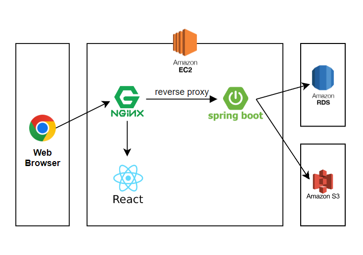
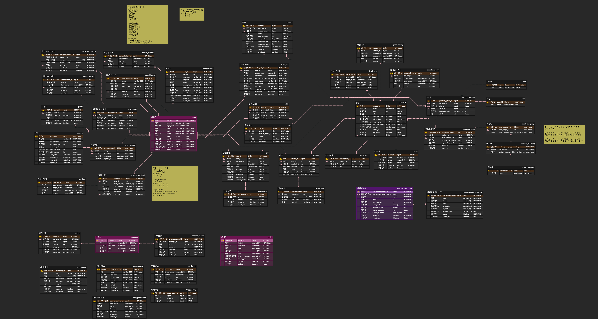

# 스파로스 아카데미 쇼핑포털 “SSG.SSAG”
 
 본 프로젝트는 스파로스 아카데미 1기에서 진행한 신시계몰 클론 코딩 프로젝트입니다.

**Project Repositories:**  
- [프론트](https://github.com/Im-hass/SSG_SSAG_FE)
- [백엔드](https://github.com/K-J-HYEON/SSG_SSAG_BE)

## 목차
1. [개발 환경](#1-개발-환경)
2. [문서](#2-문서)
3. [팀원](#3-팀원)

## 1. 개발 환경
```
* OS : Windows 10, Ubuntu 20.04.4 LTS
* Infra : AWS EC2, Nginx
* DB : AWS RDS(MySQL 8.0.28)
* Storage : AWS S3
* Backend : Spring Boot 2.6.10, Gradle(빌드), JPA(DB접근)
* Api : Naver SMS API, Naver Login API, KaKao Login API
```

## 2. 문서
### 요구사항 정의서
<a href="https://maddening-spruce-1ee.notion.site/8b2b68397df344e7b1cdc1aac1d82190">[노션 참고]</a> 

### 시스템 아키텍쳐


### DB 설계


### API 설계
<a href="https://docs.google.com/spreadsheets/d/1L2U9AW0K4CZAcw2gEB2nxJ5lRfKHPoah/edit?usp=sharing&ouid=103941929155283099338&rtpof=true&sd=true0">[구글 스프레드시트 참고]</a> 

## 3. 팀원
### SSG_SSAG팀
#### 백엔드
<a href="https://github.com/ads0070">
</a>
<a href="https://github.com/K-J-HYEON">
</a>

#### 프론트엔드
<a href="https://github.com/Im-hass">
</a>

<a href="https://https://github.com/saiani1">
</a>

<a href="https://https://github.com/codingBear01">
</a>
